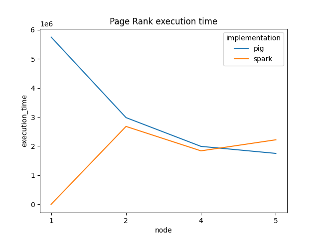

# Large Scale Data Management
Page rank computation comparisson between Pig et PySpark running on [Google Cloud Dataproc](https://cloud.google.com/dataproc?hl=en)  

### Data 
Data and code and uploaded in the local bucket but can also be found here: 
`gs://public_lddm_data/page_links_en.nt.bz2`  

Bucket creation:   
`gcloud storage buckets create gs://lddm_bucket --project=lddm-364007  --location=europe-west1 --uniform-bucket-level-access`  

### Running
> Scripts used are ***dataproc2.py*** for **Pig** and ***pagerank-notype.py*** for **PySpark**  

#### Performance
- ##### Cluster with single node  
-   **Pig**
> Machines configurations (master and workers):
        type: *n1-standard-4*  
        disk size: 95 GB
        image version: 2.0.47-debian10
        region: europe-west1
        zone: europe-west1-c 
    
    `Pig script completed in 3 hour, 10 minutes, 40 seconds and 50 milliseconds`  
    
> Machines configurations (master and workers):
        type: *n1-standard-4*  
        disk size: 500 GB
        image version: 2.0.47-debian10
        region: europe-west1
        zone: europe-west1-c   
          
    -   **Pig**  
    `2022-10-12 14:55:39,547 [main] INFO  org.apache.pig.Main - Pig script completed in 1 hour, 39 minutes, 40 seconds and 675 milliseconds (5980675 ms)  
    -   **PySpark**   
- ##### Cluster with 2 nodes 
> Machines configurations (master and workers):
        type: *n1-standard-4*  
        disk size: 500 GB
        image version: 2.0.47-debian10
        region: europe-west1
        zone: europe-west1-c 
    -   **Pig**  
    Execution completion of the script  
`Pig script completed in 49 minutes 40 seconds and 104 milliseconds (49mn 45s via l'interface graphique du job)`

    -   **PySpark**   
    Execution completion of the script  
`Script completed in 44 minutes 37 seconds `
- ##### Cluster with 4 nodes 
> Machines configurations (master and workers):
        type: *n1-standard-4*  
        disk size: 500 GB
        image version: 2.0.47-debian10
        region: europe-west1
        zone: europe-west1-c 
    -   **Pig**  
    Execution completion of the script  
    `Pig script completed in 33 minutes 11 seconds and 764 milliseconds (1991764 ms)`
    -   **PySpark**   
    Execution completion of the script  
    `Script completed in 30 minutes 38 seconds`
- ##### Cluster with 5 nodes 
> Machines configurations (master and workers):
        type: *n1-standard-4*  
        disk size: 500 GB
        image version: 2.0.47-debian10
        region: europe-west1
        zone: europe-west1-c 
    -   **Pig**  
    Execution completion of the script  
    `Pig script completed in 29 minutes 10 seconds and 344 milliseconds (1750344 ms)`
    -   **PySpark**   
    Execution completion of the script  
    `Script completed in 35 minutes 3 seconds`  
    
### Execution time plot

